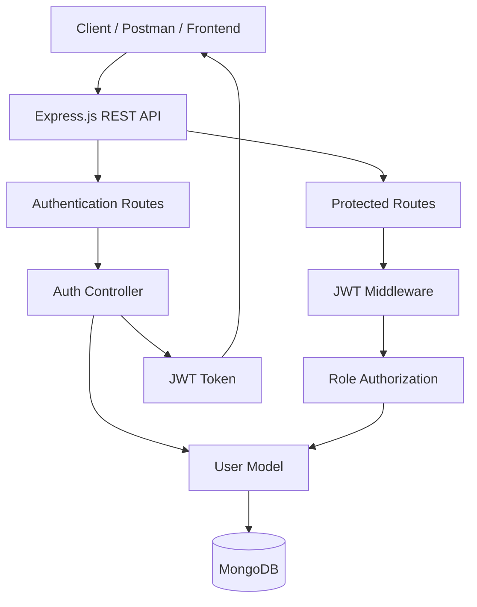
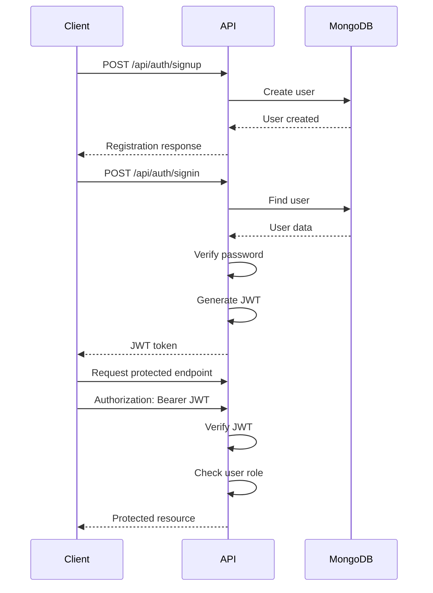
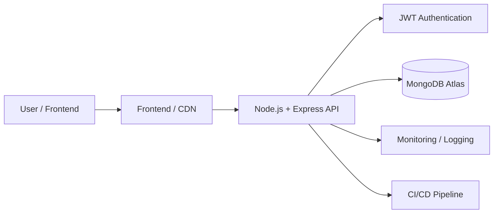

# 🔐 JWT Auth API

<p align="center">
  <strong>Secure REST API for Authentication & Role-Based Authorization</strong>
</p>

<p align="center">
  
  
  
  
  
</p>

A backend authentication and authorization system built with **Node.js, Express.js, MongoDB, Mongoose, bcryptjs, and JSON Web Tokens (JWT)**.

The project provides a modular REST API for user registration, login, JWT-based authentication, protected routes, and role-based access control.

---

## ✨ Features

* 🔑 User registration
* 🔐 Secure login
* 🔒 JWT-based authentication
* 🛡️ Protected API routes
* 👤 Role-based authorization
* 🔐 Password hashing with bcrypt
* 🍃 MongoDB integration using Mongoose
* ⚡ RESTful API architecture
* 🌐 CORS support
* 🧩 Modular backend structure
* 👥 User, Moderator, and Admin roles
* ⚙️ Environment-based configuration

---

## 🛠️ Tech Stack

| Technology         | Purpose                       |
| ------------------ | ----------------------------- |
| **Node.js**        | JavaScript runtime            |
| **Express.js**     | REST API framework            |
| **MongoDB**        | NoSQL database                |
| **Mongoose**       | MongoDB object modeling       |
| **JSON Web Token** | Authentication                |
| **bcryptjs**       | Password hashing              |
| **CORS**           | Cross-origin resource sharing |
| **Postman**        | API testing                   |

---

# 🏗️ Architecture



### Authentication Flow



---

# 📁 Project Structure

```text
jwt_auth/
│
├── app/
│   ├── config/
│   │   └── db.config.js
│   │
│   ├── controllers/
│   │   ├── auth.controller.js
│   │   └── user.controller.js
│   │
│   ├── middlewares/
│   │   ├── authJwt.js
│   │   └── verifySignUp.js
│   │
│   ├── models/
│   │   ├── index.js
│   │   ├── user.model.js
│   │   └── role.model.js
│   │
│   └── routes/
│       ├── auth.routes.js
│       └── user.routes.js
│
├── screenshots/
│   ├── postman-signup.png
│   ├── postman-login.png
│   └── protected-route.png
│
├── .env.example
├── .gitignore
├── package.json
├── package-lock.json
├── server.js
└── README.md
```

---

# 🚀 Getting Started

## Prerequisites

Make sure you have the following installed:

* [Node.js](https://nodejs.org/)
* npm
* MongoDB or MongoDB Atlas
* Postman (optional, for API testing)

---

## 1. Clone the Repository

```bash
git clone https://github.com/Kartikboxi/jwt_auth.git
```

```bash
cd jwt_auth
```

---

## 2. Install Dependencies

```bash
npm install
```

---

## 3. Configure Environment Variables

Create a `.env` file in the project root.

```env
PORT=8080
MONGODB_URI=mongodb://localhost:27017/jwt_auth
JWT_SECRET=your_super_secret_key
JWT_EXPIRATION=24h
```

> ⚠️ Never commit `.env` to GitHub.

A template is provided in `.env.example`.

---

## 4. Start MongoDB

Make sure your MongoDB server is running locally.

Alternatively, use MongoDB Atlas and provide the connection string through `MONGODB_URI`.

---

## 5. Start the Server

```bash
node server.js
```

The API will be available at:

```text
http://localhost:8080
```

---

# 📡 API Documentation

## Authentication

### Register User

```http
POST /api/auth/signup
```

Example request:

```json
{
  "username": "john",
  "email": "john@example.com",
  "password": "StrongPassword123"
}
```

---

### Login

```http
POST /api/auth/signin
```

Example request:

```json
{
  "username": "john",
  "password": "StrongPassword123"
}
```

A successful login returns a JWT token.

Example:

```json
{
  "id": "user_id",
  "username": "john",
  "email": "john@example.com",
  "roles": [
    "ROLE_USER"
  ],
  "accessToken": "eyJhbGciOiJIUzI1NiIs..."
}
```

---

# 🔒 Protected Routes

Protected endpoints require a valid JWT.

Add the token to the request header:

```http
Authorization: Bearer <YOUR_JWT_TOKEN>
```

---

## Available Access Levels

| Role        | Access                   |
| ----------- | ------------------------ |
| `user`      | User-protected resources |
| `moderator` | Moderator resources      |
| `admin`     | Administrative resources |

---

## Example Protected Request

```http
GET /api/test/user
Authorization: Bearer <YOUR_JWT_TOKEN>
```

Successful response:

```json
{
  "message": "User Content."
}
```

---

# 🧪 Testing With Postman

You can test the complete authentication flow using Postman.

### Step 1 — Register

```text
POST /api/auth/signup
```

Create a new account.

### Step 2 — Login

```text
POST /api/auth/signin
```

Copy the returned JWT token.

### Step 3 — Authorize

Add:

```text
Authorization: Bearer <YOUR_JWT_TOKEN>
```

### Step 4 — Access Protected Route

```text
GET /api/test/user
```

The server verifies the JWT before allowing access.

---

# 🖼️ API Screenshots

## User Registration


## User Login


## Protected API


> Add your own Postman screenshots to the `screenshots/` folder.

---

# 🔐 Security

This project demonstrates several important backend security concepts:

### Password Hashing

Passwords are never intended to be stored as plain text. Passwords are hashed using `bcryptjs`.

### JWT Authentication

After successful authentication, the server generates a signed JWT which the client sends with subsequent protected requests.

### Middleware-Based Authorization

Authentication and authorization logic is separated into middleware, keeping route handlers modular and easier to maintain.

### Environment Variables

Sensitive configuration such as:

* Database credentials
* JWT secret
* Application configuration

should be stored in environment variables rather than committed to source control.

---

# 🧱 Design Principles

The project follows a modular backend architecture:

```text
Routes
   ↓
Controllers
   ↓
Middleware
   ↓
Models
   ↓
MongoDB
```

This separation makes the application easier to:

* Maintain
* Test
* Extend
* Debug
* Integrate with a frontend

---

# 🔮 Future Improvements

The current project can be extended with:

* [ ] Refresh token support
* [ ] Logout and token revocation
* [ ] Password reset
* [ ] Email verification
* [ ] Request validation
* [ ] Rate limiting
* [ ] Helmet security middleware
* [ ] Swagger / OpenAPI documentation
* [ ] Automated unit tests
* [ ] Integration tests
* [ ] Docker support
* [ ] GitHub Actions CI/CD
* [ ] MongoDB Atlas deployment
* [ ] Production deployment
* [ ] Frontend integration with React
* [ ] Access and refresh token rotation

---

# 🌐 Possible Production Architecture



---

# 📚 What This Project Demonstrates

This project demonstrates practical understanding of:

* REST API development
* Authentication
* Authorization
* JWT
* Password hashing
* Middleware
* MongoDB
* Mongoose
* Express.js
* Backend project architecture
* Environment configuration
* API testing

---

# 👨‍💻 Author

**Kartikboxi**

GitHub:
https://github.com/Kartikboxi

---

# ⭐ Support

If you found this project useful, consider giving it a ⭐ on GitHub.

Contributions, suggestions, and improvements are welcome.

---

## 📄 License

This project is available under the license specified in the repository.
